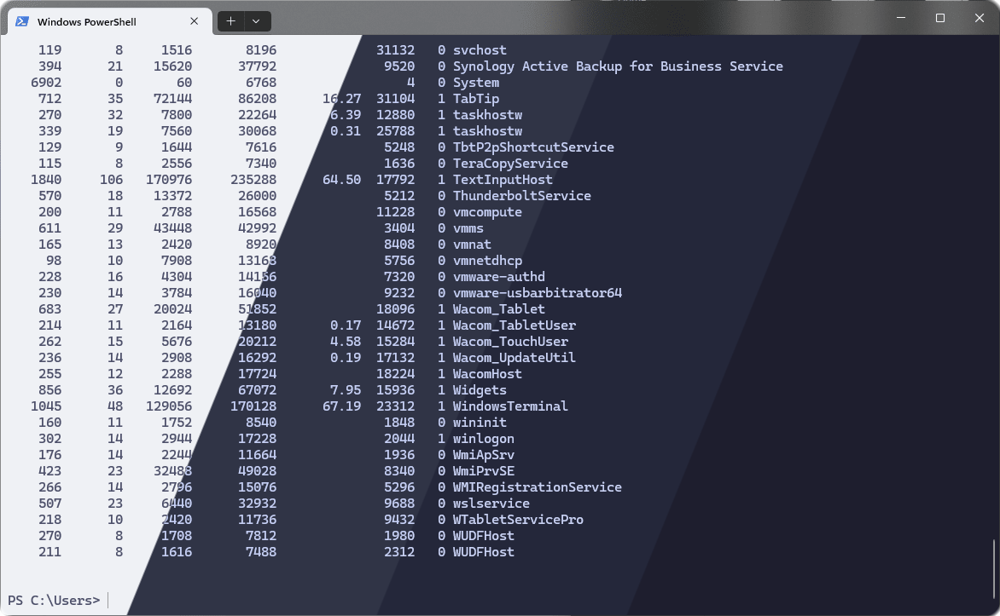
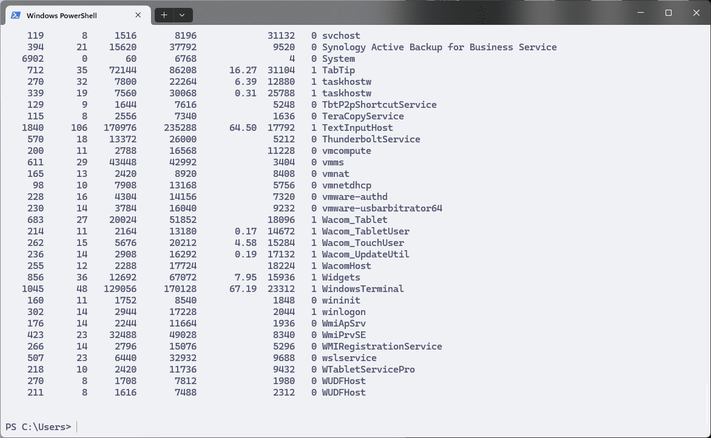
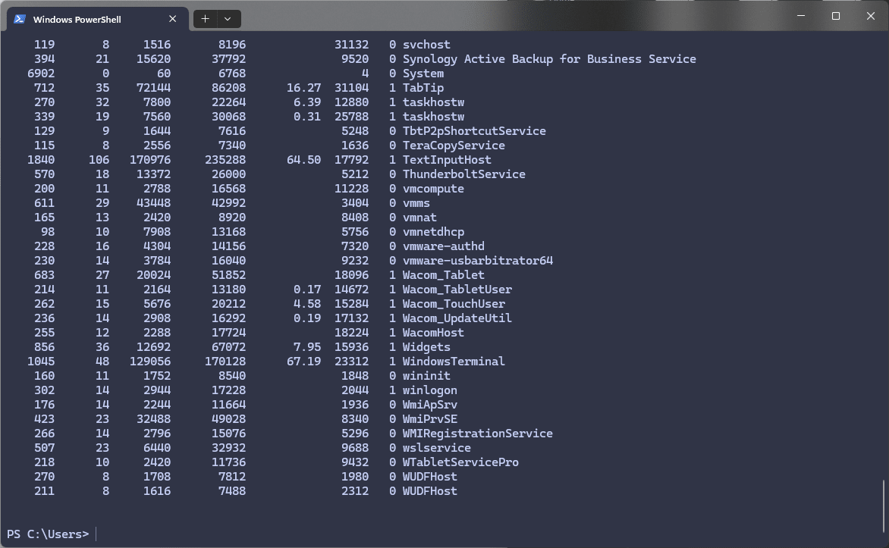
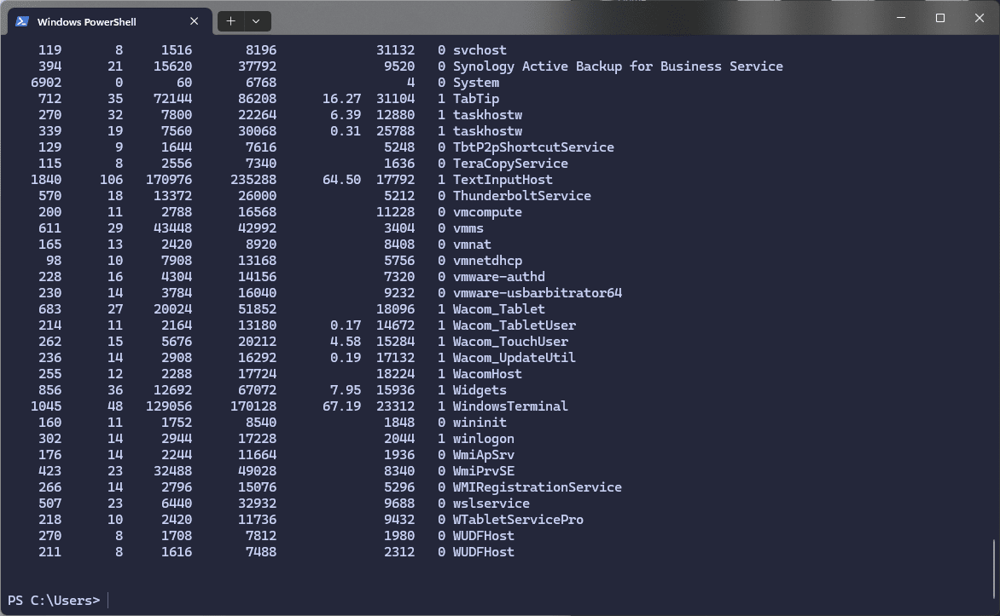
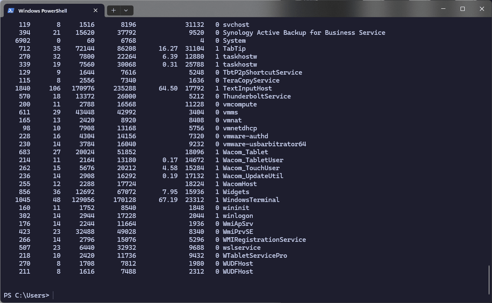

<h3 align="center">
	 
	
	Catppuccin for <a href="https://www.royalapps.com/ts/win/features">Windows Terminal</a>
	
</h3>

	
	
	

	

## Previews

🌻 Latte

	

🪴 Frappé

	

🌺 Macchiato

		

🌿 Mocha

	

## Usage

1. Download the JSON configuration: *[catppuccin.json](./assets/catppuccin.json)*.
2. Open Windows Terminal and press Ctrl + , to open Settings.
3. Click the 'Open JSON file' button in the bottom left and overwrite with the contents of this JSON.

## 💝 Thanks to

- [grokdesigns](https://github.com/grokdesigns)

&nbsp;

	

	Copyright &copy; 2021-present <a href="https://github.com/catppuccin" target="_blank">Catppuccin Org</a>

	

